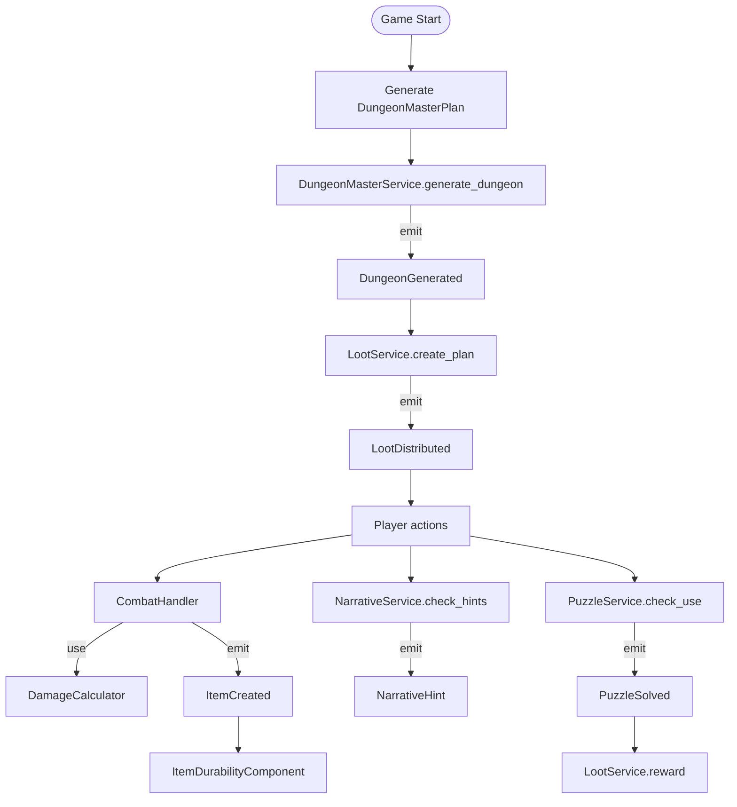

# Dungeon & Item Systems Architecture

## Overview
The **Dungeon & Item Systems** extend the existing DarkDelve domain to provide a fully‑featured, difficulty‑aware dungeon generator, a rich item creation pipeline, durability handling, a Hero‑System style damage model, narrative orchestration, loot catering, and puzzle mechanics.  All new concepts live under the `src/domain` package and are configured via `config/game.yaml`.

```
src/
├─ domain/
│  ├─ value_objects/        # Pure data structures (no behaviour)
│  │   ├─ difficulty.py
│  │   ├─ item_creation.py
│  │   ├─ durability.py
│  │   ├─ damage_model.py
│  │   ├─ narrative.py
│  │   ├─ loot_plan.py
│  │   ├─ puzzle_items.py
│  │   ├─ perception.py
│  │   ├─ social.py
│  │   ├─ behavior_script.py
│  │   ├─ llm_logging.py
│  │   ├─ power_levels.py
│  │   └─ stats.py
│  ├─ components/           # Behaviour attached to entities / services
│  │   ├─ dungeon_control.py
│  │   ├─ item_factory.py
│  │   ├─ item_durability.py
│  │   ├─ damage_calculator.py
│  │   ├─ narrative.py
│  │   ├─ loot_planner.py
│  │   ├─ puzzle_mechanic.py
│  │   ├─ ai.py
│  │   ├─ behavior_component.py
│  │   ├─ combat.py
│  │   ├─ perception_component.py
│  │   ├─ inventory.py
│  │   ├─ equipment.py
│  │   └─ movement.py
│  ├─ services/             # Orchestrators that use the above VO/Components
│  │   ├─ dungeon_master_service.py
│  │   ├─ item_factory_service.py
│  │   ├─ loot_service.py
│  │   ├─ narrative_service.py
│  │   ├─ puzzle_service.py
│  │   ├─ context_manager.py
│  │   ├─ perception_service.py
│  │   ├─ behavior_script_service.py
│  │   ├─ level_design_service.py
│  │   ├─ social_service.py
│  │   ├─ player_profile_service.py
│  │   └─ entity_ai_orchestrator.py
│  └─ ... (existing entities, components, services)
├─ infrastructure/
│  └─ configuration/
│      ├─ config_loader.py
│      └─ entity_ai_config_loader.py
└─ architecture/dungeon_item_systems.md   # <‑‑ this document
```

The systems interact through the **Event Bus** (`src/application/event_system/event_bus.py`) and the **Domain Service Layer**.  The DM (`DungeonMasterAgent`) drives the generation flow, while the **ItemFactory** creates items on‑demand, optionally using the LLM via `OllamaService`.

---

## New Files to Create
| Path | Purpose |
|------|---------|
| `src/domain/value_objects/difficulty.py` | Enums & dataclasses for `DifficultyMode`, `DungeonLevel`, `Room`, `MobSpawn`, `ItemSpawn`, `DungeonMasterPlan`, `LevelNarrative`, `BossEncounter`, `KeyItem` |
| `src/domain/value_objects/item_creation.py` | Enums `ItemType`, `ItemPower`, `ItemDefense`, `ItemModifier`, `ItemCurse` and the core `ItemStats` dataclass |
| `src/domain/value_objects/durability.py` | `DurabilityConfig` and `ItemDurabilityComponent` data structures |
| `src/domain/value_objects/damage_model.py` | `DamageInstance`, `DamageResult`, `ResistanceProfile`, `DamageCalculator` |
| `src/domain/value_objects/narrative.py` | `StoryOutline`, `NarrativeEvent`, `LevelNarrative`, `BossEncounter`, `KeyItem` (re‑exported for clarity) |
| `src/domain/value_objects/loot_plan.py` | `LootPlan` dataclass |
| `src/domain/value_objects/puzzle_items.py` | `PuzzleItem`, `PuzzleMechanic` |
| `src/domain/value_objects/perception.py` | `PerceptionSense`, `PerceptionModifiers`, `PerceptionStatus` |
| `src/domain/value_objects/social.py` | `SocialRelationship`, `SocialStructure`, `LoyaltyState` |
| `src/domain/value_objects/behavior_script.py` | `BehaviorNode`, `BehaviorScript` |
| `src/domain/value_objects/llm_logging.py` | `ContextWindowDiagnostics`, `TokenBudget`, `LLMCallLog`, `LLMPerformanceMetrics`, `LLMLogger` |
| `src/domain/value_objects/power_levels.py` | `PowerLevels` dataclass |
| `src/domain/components/dungeon_control.py` | Component that holds the current `DungeonLevel` and exposes generation hooks |
| `src/domain/components/item_factory.py` | High‑level façade that uses `ItemFactory` (LLM‑backed) to produce `Item` entities |
| `src/domain/components/item_durability.py` | Component that tracks durability state and applies degradation logic |
| `src/domain/components/damage_calculator.py` | Wrapper around `DamageCalculator` VO to integrate with combat component |
| `src/domain/components/narrative.py` | Handles story outline progression, hint distribution, and event emission |
| `src/domain/components/loot_planner.py` | Generates `LootPlan` per level based on player profile and difficulty |
| `src/domain/components/puzzle_mechanic.py` | Manages puzzle item placement and resolution logic |
| `src/domain/services/dungeon_master_service.py` | Orchestrates level generation, difficulty scaling, and boss chain creation |
| `src/domain/services/item_factory_service.py` | Provides a clean API for the DM to request items (including boss‑slayer, puzzle, trash) |
| `src/domain/services/loot_service.py` | Applies `LootPlan` to a `DungeonLevel`, updates inventory, and emits loot events |
| `src/domain/services/narrative_service.py` | Updates `StoryOutline`, triggers `NarrativeEvent`s, and stores hints |
| `src/domain/services/puzzle_service.py` | Validates puzzle requirements, tracks solved state, and rewards players |
| `src/domain/services/context_manager.py` | Manages LLM context window, tracks token usage, provides headroom diagnostics |
| `src/domain/services/perception_service.py` | Populate `PerceptionStatus` from FOV query |
| `src/domain/services/behavior_script_service.py` | Parse and execute behavior scripts |
| `src/domain/services/level_design_service.py` | Generate level layouts via LLM |
| `src/domain/services/social_service.py` | Manage relationships & loyalty |
| `src/domain/services/player_profile_service.py` | Build PlayerProfile for LLM level design |
| `src/domain/services/entity_ai_orchestrator.py` | Orchestrate AI systems together |
| `config/entity_ai.yaml` | YAML configuration for mob types, perception, social structures |
| `src/infrastructure/configuration/entity_ai_config_loader.py` | Python class for loading and accessing entity AI configuration |

## Existing Files to Modify
| File | Change |
|------|--------|
| `src/domain/services/level_design_service.py` | Import `DungeonMasterPlan` and expose a method `apply_plan(plan: DungeonMasterPlan)` that configures level size, room count, and difficulty. |
| `src/domain/services/entity_ai_orchestrator.py` | Add imports for `NarrativeEvent` and `PuzzleMechanic`; inject `NarrativeService` and `PuzzleService` to allow AI agents to react to story cues and puzzles. |
| `src/application/event_system/event_bus.py` | Register new event types: `DungeonGenerated`, `ItemCreated`, `LootDistributed`, `PuzzleSolved`, `NarrativeHint`. |
| `src/domain/components/combat.py` | Replace direct damage math with a call to `DamageCalculator` component. |
| `src/domain/entities/item.py` | Extend to include `ItemStats`, `modifiers`, `curses`, and durability fields (via composition with `ItemDurabilityComponent`). |

---

## Data Structures (Full Definitions)

### `src/domain/value_objects/difficulty.py`
```python
from __future__ import annotations
from dataclasses import dataclass, field
from enum import Enum
from typing import List, Optional, Dict, TYPE_CHECKING

class DifficultyMode(Enum):
    STORY = "story"           # easy, focus on narrative
    NORMAL = "normal"         # balanced challenge + loot
    HARD = "hard"             # challenging, less loot
    NIGHTMARE = "nightmare"   # brutal, minimal loot
    IRONMAN = "ironman"       # permadeath, hardcore

@dataclass
class Room:
    x: int
    y: int
    width: int
    height: int
    room_type: str            # "normal", "treasure", "boss", "puzzle", "shrine", "trap"
    connected_rooms: List[int] = field(default_factory=list)
    description: str = ""

@dataclass
class MobSpawn:
    mob_type: str
    position: "Position"
    social_structure_hint: str
    behavior_override: Optional[str] = None

@dataclass
class ItemSpawn:
    item_id: str
    position: "Position"
    is_ground: bool = True
    container_id: Optional[str] = None
    is_trash: bool = False
    puzzle_role: Optional[str] = None

@dataclass
class DungeonLevel:
    level_number: int
    difficulty: DifficultyMode
    width: int
    height: int
    rooms: List[Room]
    corridors: List["Corridor"]
    mobs: List[MobSpawn]
    items: List[ItemSpawn]
    traps: List["TrapSpawn"]
    exits: List["Exit"]
    narrative_id: str
    boss_id: Optional[str] = None
    hints: List[str] = field(default_factory=list)
    required_items: List[str] = field(default_factory=list)
    tags: List[str] = field(default_factory=list)

@dataclass
class LevelNarrative:
    level_number: int
    title: str
    description: str
    hints_dropped: List[str] = field(default_factory=list)
    boss_name: Optional[str] = None
    boss_hint: Optional[str] = None
    required_key_items: List[str] = field(default_factory=list)

@dataclass
class BossEncounter:
    boss_id: str
    boss_type: str
    level_number: int
    name: str
    description: str
    weaknesses: List[str]
    resistances: List[str]
    special_loot: List[str]
    pre_level_hints: List[str] = field(default_factory=list)

@dataclass
class KeyItem:
    item_id: str
    name: str
    item_type: str
    found_level: int
    used_level: int
    description: str
    powers: List[str]

@dataclass
class DungeonMasterPlan:
    difficulty: DifficultyMode
    total_levels: int
    theme: str
    story_outline: List[LevelNarrative]
    boss_chain: List[BossEncounter]
    key_items: List[KeyItem]
    player_power_target: Dict[str, float]
```

### `src/domain/value_objects/item_creation.py`
```python
from __future__ import annotations
from dataclasses import dataclass, field
from enum import Enum
from typing import List, Dict, Optional

class ItemType(Enum):
    SWORD = "sword"
    AXE = "axe"
    MACE = "mace"
    DAGGER = "dagger"
    SPEAR = "spear"
    BOW = "bow"
    SHIELD = "shield"
    POTION = "potion"
    WAND = "wand"
    RING = "ring"
    AMULET = "amulet"
    SCROLL = "scroll"

class ItemPower(Enum):
    FIRE = "fire"
    ICE = "ice"
    LIGHTNING = "lightning"
    POISON = "poison"
    HOLY = "holy"
    SHADOW = "shadow"
    BLOOD = "blood"
    ARCANE = "arcane"
    NECROTIC = "necrotic"
    RADIANT = "radiant"
    THUNDER = "thunder"
    ACID = "acid"

class ItemDefense(Enum):
    PHYSICAL = "physical"
    FIRE_DEF = "fire"
    ICE_DEF = "ice"
    LIGHTNING_DEF = "lightning"
    POISON_DEF = "poison"
    HOLY_DEF = "holy"
    SHADOW_DEF = "shadow"
    BLOOD_DEF = "blood"
    ARCANE_DEF = "arcane"
    NECROTIC_DEF = "necrotic"
    RADIANT_DEF = "radiant"
    THUNDER_DEF = "thunder"

class ItemModifier(Enum):
    SHARP = "sharp"
    HEAVY = "heavy"
    SWIFT = "swift"
    PRECISE = "precise"
    VAMPIRIC = "vampiric"
    BERSERK = "berserk"
    GUARDIAN = "guardian"
    ETHEREAL = "ethereal"
    EXPLOSIVE = "explosive"
    CHAINED = "chained"
    MIRROR = "mirror"
    ECHOING = "echoing"

class ItemCurse(Enum):
    BLOODTHIRSTY = "bloodthirsty"
    HEAVY = "heavy"
    CURSED = "cursed"
    FRAGILE = "fragile"
    HUNGRY = "hungry"
    TREACHEROUS = "treacherous"
    BINDING = "binding"
    DOOMED = "doomed"
    HOLLOW = "hollow"
    PARASITIC = "parasitic"
    VENGEFUL = "vengeful"
    UNSTABLE = "unstable"

@dataclass
class ItemStats:
    damage: float = 0.0
    damage_type: str = "physical"
    defense: float = 0.0
    defense_type: str = "physical"
    attack_speed: float = 1.0
    critical_chance: float = 0.05
    critical_damage: float = 1.5
    range: float = 1.0
    block_chance: float = 0.0
    durability_max: int = 100
    durability_current: int = 100
    uses_remaining: int = -1
    weight: float = 1.0
    required_level: int = 1
    required_stats: Dict[str, float] = field(default_factory=dict)

@dataclass
class Item:
    item_id: str
    name: str
    description: str
    item_type: str
    rarity: str
    powers: List[str]
    defenses: List[str]
    modifiers: List[str]
    curses: List[str]
    stats: ItemStats
    special_abilities: List[str] = field(default_factory=list)
    lore_text: str = ""
    is_quest_item: bool = False
    puzzle_role: Optional[str] = None
    boss_bonus: Optional[str] = None
    level_origin: int = 0
    value_gold: int = 0
    is_identified: bool = True
```

### `src/domain/value_objects/durability.py`
```python
from __future__ import annotations
from dataclasses import dataclass, field
from typing import List, Dict

@dataclass
class DurabilityConfig:
    base_durability: Dict[str, int] = field(default_factory=lambda: {
        "sword": 100, "axe": 120, "mace": 150, "dagger": 60,
        "spear": 80, "bow": 70, "shield": 200, "potion": 1,
        "wand": 30, "ring": 999, "amulet": 999, "scroll": 1,
    })
    hit_durability_loss: int = 1
    block_durability_loss: int = 3
    crit_durability_loss: int = 5
    degradation_threshold: float = 0.5
    repair_stations: List[str] = field(default_factory=lambda: ["shrine", "forge"])

@dataclass
class ItemDurabilityComponent:
    item_id: str
    condition: float = 1.0
    times_repaired: int = 0
    max_repairs: int = 3
    is_broken: bool = False

    def degrade(self, amount: float):
        self.condition = max(0.0, self.condition - amount)
        if self.condition <= 0:
            self.is_broken = True

    def can_repair(self) -> bool:
        return not self.is_broken and self.times_repaired < self.max_repairs

    def repair(self, amount: float) -> bool:
        if not self.can_repair():
            return False
        self.condition = min(1.0, self.condition + amount)
        self.times_repaired += 1
        return True
```

### `src/domain/value_objects/damage_model.py`
```python
from __future__ import annotations
from dataclasses import dataclass, field
from typing import Dict

@dataclass
class DamageInstance:
    raw_damage: float
    damage_type: str
    source_id: str
    target_id: str
    is_critical: bool = False
    is_blocked: bool = False
    is_dodged: bool = False
    overkill: float = 0.0

@dataclass
class DamageResult:
    final_damage: float
    was_blocked: bool
    was_dodged: bool
    was_critical: bool
    overkill: float
    resistance_applied: float
    resistance_type: str
    target_died: bool = False

@dataclass
class ResistanceProfile:
    resistances: Dict[str, float] = field(default_factory=dict)

    def get_resistance(self, damage_type: str) -> float:
        return self.resistances.get(damage_type, 0.0)

    def set_resistance(self, damage_type: str, value: float):
        self.resistances[damage_type] = max(0.0, min(1.0, value))

class DamageCalculator:
    def calculate_damage(
        self,
        attacker_power: float,
        damage_type: str,
        defender_resistance: float,
        defender_armor: float,
        is_critical: bool = False,
        critical_multiplier: float = 1.5,
    ) -> DamageResult:
        raw = attacker_power * (critical_multiplier if is_critical else 1.0)
        resisted = raw * defender_resistance
        after_resistance = raw - resisted
        after_armor = max(1.0, after_resistance - defender_armor)
        return DamageResult(
            final_damage=after_armor,
            was_blocked=False,
            was_dodged=False,
            was_critical=is_critical,
            overkill=0.0,
            resistance_applied=resisted,
            resistance_type=damage_type,
        )

    def calculate_with_block(self, damage: DamageResult, block_chance: float, block_value: float) -> DamageResult:
        import random
        if random.random() < block_chance:
            damage.final_damage = max(0, damage.final_damage - block_value)
            damage.was_blocked = True
        return damage

    def calculate_with_dodge(self, damage: DamageResult, dodge_chance: float) -> DamageResult:
        import random
        if random.random() < dodge_chance:
            damage.final_damage = 0
            damage.was_dodged = True
        return damage
```

### `src/domain/value_objects/narrative.py`
```python
from __future__ import annotations
from dataclasses import dataclass, field
from typing import List, Optional

@dataclass
class LevelNarrative:
    level_number: int
    title: str
    description: str
    hints_dropped: List[str] = field(default_factory=list)
    boss_name: Optional[str] = None
    boss_hint: Optional[str] = None
    required_key_items: List[str] = field(default_factory=list)

@dataclass
class BossEncounter:
    boss_id: str
    boss_type: str
    level_number: int
    name: str
    description: str
    weaknesses: List[str]
    resistances: List[str]
    special_loot: List[str]
    pre_level_hints: List[str] = field(default_factory=list)

@dataclass
class KeyItem:
    item_id: str
    name: str
    item_type: str
    found_level: int
    used_level: int
    description: str
    powers: List[str]

@dataclass
class StoryOutline:
    outline_id: str
    title: str
    theme: str
    difficulty: str
    total_levels: int
    levels: List[LevelNarrative]
    bosses: List[BossEncounter]
    key_items: List[KeyItem]
    opening_narrative: str
    closing_narrative: str
    twist_narrative: Optional[str] = None

    def get_hints_for_level(self, level: int) -> List[str]:
        hints = []
        for lvl in self.levels:
            if lvl.level_number <= level:
                hints.extend(lvl.hints_dropped)
        return hints

    def get_required_items_for_level(self, level: int) -> List[str]:
        for lvl in self.levels:
            if lvl.level_number == level:
                return lvl.required_key_items
        return []

@dataclass
class NarrativeEvent:
    event_id: str
    trigger: str
    level_number: int
    text: str
    speaker: Optional[str] = None
    requires_items: List[str] = field(default_factory=list)
    blocks_progress: bool = False
```

### `src/domain/value_objects/loot_plan.py`
```python
from __future__ import annotations
from dataclasses import dataclass, field
from typing import List

@dataclass
class LootPlan:
    level_number: int
    items: List["Item"]
    target_power_type: str
    target_challenge: str
    catering_items: List[str] = field(default_factory=list)
    challenge_items: List[str] = field(default_factory=list)
    trash_items: List["Item"] = field(default_factory=list)
```

### `src/domain/value_objects/puzzle_items.py`
```python
from __future__ import annotations
from dataclasses import dataclass, field
from typing import List

@dataclass
class PuzzleItem:
    item_id: str
    name: str
    description: str
    found_level: int
    used_level: int
    puzzle_description: str
    is_identified: bool = False
    is_collected: bool = False

@dataclass
class PuzzleMechanic:
    puzzle_id: str
    level_number: int
    required_item_ids: List[str]
    description: str
    reward: str
    is_solved: bool = False
```

---

## System Details

### 1️⃣ Difficulty & Dungeon Level Control
* **Entry point:** `DungeonMasterService.generate_dungeon(plan: DungeonMasterPlan)`
* Uses `DifficultyMode` to select scaling factors for mob count, trap density, and loot rarity.
* `DungeonLevel` aggregates rooms, corridors, mob spawns, and item spawns.  The DM populates `rooms` via a **room‑placement algorithm** (existing in `LevelDesignService`).
* `DungeonMasterPlan` is built from the LLM‑generated `StoryOutline` and player power targets.

### 2️⃣ Item Creation System
* `ItemFactoryService` wraps the `ItemFactory` component.  It can be called directly by the DM or by AI agents.
* Enums (`ItemType`, `ItemPower`, …) guarantee a **fixed vocabulary** while still allowing combinatorial explosion.
* `ItemStats` captures combat numbers; modifiers and curses are stored as string lists for easy serialization.

### 3️⃣ Durability & Damage System
* `DurabilityConfig` lives in the config file; the `ItemDurabilityComponent` is attached to each `Item` entity.
* `DamageCalculator` implements the Hero‑System style flow (resistance → armor → block/dodge).  It is invoked from `CombatComponent`.

### 4️⃣ Hero‑System RPG Damage Model
* `CombatHandler` (in `src/application/event_system/handlers/combat_handler.py`) now delegates to `DamageCalculator` via the new `DamageComponent`.
* `ResistanceProfile` is stored on the `Entity` (players, mobs) and can be modified by buffs/debuffs.

### 5️⃣ DM Story Outline & Narrative System
* `StoryOutline` is generated once at game start by the `DungeonMasterAgent` using the LLM.
* `NarrativeService` tracks the current outline, emits `NarrativeEvent`s, and provides hints to the player via the UI.

### 6️⃣ Loot Catering System
* `LootPlannerComponent` analyses the player's `Stats`, `PowerLevels`, and current `DifficultyMode` to produce a `LootPlan`.
* Items marked as `catering_items` boost the player's build; `challenge_items` exploit weaknesses.

### 7️⃣ Puzzle/Trash Item System
* `PuzzleService` registers `PuzzleMechanic`s and validates when a player uses a `PuzzleItem`.
* Trash items are generated with `ItemFactory.create_trash_item` and may hide a `PuzzleItem` role.

### 8️⃣ Item Factory (DM‑side)
* The factory can be **LLM‑augmented**: `create_from_scenario` sends a prompt to `OllamaService` and parses the response into an `Item`.
* Deterministic helpers (`create_boss_slayer`, `create_puzzle_item`) ensure reproducibility for tests.

### 9️⃣ Context Manager System
* **File:** `src/domain/services/context_manager.py`
* **Purpose:** Manages LLM context window for maximum effectiveness
* **Key Features:**
  - Token estimation and tracking
  - Context headroom diagnostics
  - History trimming for token budget management
  - System prompt management

---

## Integration Points
* **Event Bus** – New events (`DungeonGenerated`, `ItemCreated`, `LootDistributed`, `PuzzleSolved`, `NarrativeHint`) are published and consumed by UI controllers and AI agents.
* **Domain Services** – `DungeonMasterService` calls `LevelDesignService` (existing) and the new `NarrativeService`/`LootService`.
* **Components** – Existing `CombatComponent` now composes `DamageCalculator`; `InventoryComponent` stores `ItemDurabilityComponent`.
* **Configuration** – `config/game.yaml` gains sections `difficulty`, `durability`, `damage` that are loaded by `ConfigLoader`.
* **LLM Integration** – `ItemFactory` uses `src/infrastructure/external/ollama_service.py` to generate flavorful names and descriptions.

---

## Configuration Schema (`config/game.yaml`)
```yaml
difficulty:
  default: normal
  scaling:
    story: 0.5
    normal: 1.0
    hard: 1.5
    nightmare: 2.0
    ironman: 3.0
durability:
  base:
    sword: 100
    axe: 120
    # … other defaults as in DurabilityConfig
  hit_loss: 1
  block_loss: 3
  crit_loss: 5
  degradation_threshold: 0.5
  repair_stations: [shrine, forge]
damage:
  critical_multiplier: 1.5
  armor_minimum: 1
  resistance_default: 0.0
```

---

## LLM Prompt Templates
* **Story Outline Generation**
```
You are a Dungeon Master. Generate a story outline for a {theme} dungeon with {total_levels} levels at {difficulty} difficulty. Include level titles, brief descriptions, boss names, and key items. Return JSON matching the `StoryOutline` schema.
```
* **Item Creation**
```
Create an item for level {level} that counters the player's dominant power type "{player_power}". Use the enums from `ItemType`, `ItemPower`, `ItemDefense`, `ItemModifier`, `ItemCurse`. Return JSON matching the `Item` dataclass.
```
* **Loot Planning**
```
Given the player profile (stats, power levels) and difficulty {difficulty}, produce a list of items that will both cater to the player and present a challenge. Include at least one `catering_item` and one `challenge_item`. Return JSON matching `LootPlan`.
```

---

## Event Flow Diagram


---

## Testing Strategy
* **Unit Tests** – One test file per new value object/component/service (e.g., `tests/test_difficulty.py`, `tests/test_item_factory.py`).  Tests cover:
  * Dataclass default values and validation.
  * `DungeonMasterService` produces a `DungeonLevel` matching the requested difficulty.
  * `ItemFactoryService` creates items with correct enums and stats.
  * `DamageCalculator` respects resistance, armor, block, and dodge logic.
  * `DurabilityComponent` degrades and repairs according to `DurabilityConfig`.
  * `NarrativeService` returns correct hints for a given level.
  * `PuzzleService` only solves when required items are present.
* **Integration Tests** – Extend existing `test_dungeon_master_agent.py` to assert that a generated dungeon emits `DungeonGenerated` and that loot matches the `LootPlan`.
* **Property‑Based Tests** – Use `hypothesis` to generate random `ItemStats` and verify that `DamageCalculator` never returns negative damage.
* **Regression Guard** – All new tests are added to the CI pipeline; any failure will block merges per the `.roo/rules/rules.md` policy.

---

*Document generated by the Architect mode.*
