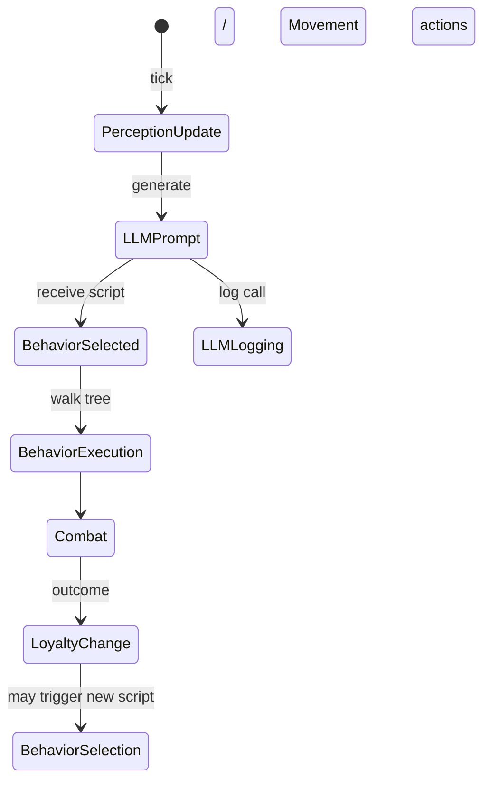

# Entity AI System Architecture

**Location:** `architecture/entity_ai_system.md`

## Overview
The Entity AI System introduces a layered architecture that replaces the previous monolithic AI component with a set of **modular, data‑driven subsystems**.  All subsystems interact through well‑defined data contracts and the existing **event bus** (`src/application/event_system/event_bus.py`).  The high‑level flow is:

1. **Perception** – `PerceptionStatus` is populated each tick from the FOV query (`src/application/game_queries/fov_query.py`).
2. **Decision Engine** – The LLM (`src/domain/agents/llm_agent.py`) receives the `PerceptionStatus` and optional `PlayerProfile` and returns a **BehaviorScript** (JSON tree).
3. **Behavior Execution** – `BehaviorEngine` (new) walks the tree, invoking actions defined in `src/domain/components/ai.py` and other services.
4. **Social & Loyalty** – Social structures influence which script is selected and modify action parameters.
5. **Power & Skill Layers** – Extend the existing `Stats` value object (`src/domain/value_objects/stats.py`) with power‑level and skill modifiers that are consulted during combat and decision making.
6. **LLM Performance Logging** – Every LLM call is recorded to `playtest/telemetry/llm_performance.json` for analysis.

---

## New Files to Create
 | Path | Purpose |
 |------|---------|
 | `src/domain/value_objects/perception_status.py` | `PerceptionStatus` dataclass and modifiers |
 | `src/domain/value_objects/behavior_script.py` | Data model for behavior trees |
 | `src/domain/value_objects/social.py` | `SocialRelationship`, `SocialStructure`, `Loyalty` dataclasses |
 | `src/domain/value_objects/power_levels.py` | Power‑level categories (offensive/defensive) |
 | `src/domain/value_objects/skill_set.py` | Skill enumeration and modifiers |
 | `src/domain/value_objects/player_profile.py` | `PlayerProfile` for LLM level design |
 | `src/domain/value_objects/llm_logging.py` | `LLMCallLog` & `LLMPerformanceMetrics` |
 | `src/domain/services/perception_service.py` | Populate `PerceptionStatus` from FOV query |
 | `src/domain/services/behavior_engine.py` | Execute `BehaviorScript` trees |
 | `src/domain/services/social_service.py` | Manage relationships & loyalty |
 | `src/domain/services/power_service.py` | Compute offensive/defensive power values |
 | `src/domain/services/skill_service.py` | Resolve skill effects on actions |
 | `src/domain/services/llm_performance_service.py` | Write logs to telemetry path |
 | `architecture/entity_ai_system.md` | This document |

## Existing Files to Modify
 | File | Change |
 |------|--------|
 | `src/domain/components/ai.py` | Replace direct map access with a call to `PerceptionService.get_status(entity_id)` and expose a `process_behavior(script: BehaviorScript)` method that delegates to `BehaviorEngine`. |
 | `src/domain/agents/llm_agent.py` | Update `generate_prompt` to accept a `PerceptionStatus` and optional `PlayerProfile`; change return type to `BehaviorScript`. |
 | `src/application/game_queries/fov_query.py` | Export a helper `compute_fov(entity_id) -> Set[Position]` used by `PerceptionService`. |
 | `src/application/event_system/event_bus.py` | Add new event types `PerceptionUpdated`, `BehaviorScriptSelected`, `LoyaltyChanged`. |
 | `src/domain/value_objects/stats.py` | Extend with `PowerLevels` field (reference new dataclass). |

---

## Data Structures

### PerceptionStatus (`src/domain/value_objects/perception.py`)
```python
from dataclasses import dataclass
from typing import List, Optional, Dict, Any

@dataclass
class PerceptionStatus:
    entity_id: str
    can_see_player: bool = False
    can_hear_player: bool = False
    can_smell_player: bool = False
    player_last_known_position: Optional[Any] = None
    player_noise_level: float = 0.0
    player_distance_estimate: float = -1.0
    visible_threats: List[str] = field(default_factory=list)
    visible_items: List[str] = field(default_factory=list)
    visible_allies: List[str] = field(default_factory=list)
    visible_enemies: List[str] = field(default_factory=list)
    environment_danger: float = 0.0
    light_level: float = 1.0
    nearby_traps: int = 0
    nearby_exits: int = 0
    combat_occurring_nearby: bool = False
    ally_health_status: str = "unknown"
    time_since_player_seen: float = -1.0
    custom_flags: Dict[str, Any] = field(default_factory=dict)
```

### PerceptionModifiers (`src/domain/value_objects/perception.py`)
```python
@dataclass
class PerceptionModifiers:
    entity_type: str
    sight_range: float = 8.0
    hearing_range: float = 12.0
    smell_range: float = 4.0
    vibration_range: float = 6.0
    echolocation_range: float = 10.0
    magic_sense_range: float = 5.0
    darkvision: bool = False
    see_invisible: bool = False
    ignore_walls_hearing: bool = False
    ignore_walls_vibration: bool = False
    noise_sensitivity: float = 1.0
    light_sensitivity: float = 1.0
    darkness_penalty: float = 0.5
```

### BehaviorScript (`src/domain/value_objects/behavior_script.py`)
```python
from dataclasses import dataclass
from typing import List, Dict, Any, Optional

@dataclass
class BehaviorNode:
    node_id: str
    node_type: str  # "condition" | "action" | "selector" | "sequence"
    priority: int
    conditions: Optional[List[Dict[str, Any]]] = None
    action: Optional[Dict[str, Any]] = None
    children: Optional[List["BehaviorNode"]] = None

@dataclass
class BehaviorScript:
    script_id: str
    root: BehaviorNode
    version: str = "1.0"
```

### SocialRelationship & SocialStructure (`src/domain/value_objects/social.py`)
```python
@dataclass
class SocialRelationship:
    entity_a_id: str
    entity_b_id: str
    relationship_type: str  # "ally", "enemy", "neutral"
    strength: float = 0.0  # -1.0 to 1.0
    history: List[str] = field(default_factory=list)

@dataclass
class SocialStructure:
    structure_id: str
    structure_type: str  # SocialStructureType value
    leader_id: str
    member_ids: List[str] = field(default_factory=list)
    hierarchy: Dict[str, int] = field(default_factory=dict)
    shared_goals: List[str] = field(default_factory=list)
    wealth_pool: float = 0.0
    relationships: List[SocialRelationship] = field(default_factory=list)

@dataclass
class LoyaltyState:
    minion_id: str
    leader_id: str
    loyalty_score: float = 0.5  # 0.0 to 1.0
    base_loyalty: float = 0.5
    modifiers: List[Dict[str, Any]] = field(default_factory=list)
```

### PowerLevels (`src/domain/value_objects/power_levels.py`)
```python
from dataclasses import dataclass

@dataclass
class PowerLevels:
    # Offensive
    melee_strength: int = 0
    melee_precision: int = 0
    piercing: int = 0
    slashing: int = 0
    bludgeoning: int = 0
    fire_magic: int = 0
    ice_magic: int = 0
    lightning_magic: int = 0
    poison_magic: int = 0
    arcane_magic: int = 0
    divine_magic: int = 0
    shadow_magic: int = 0
    # Defensive
    physical_armor: int = 0
    piercing_resist: int = 0
    slashing_resist: int = 0
    bludgeoning_resist: int = 0
    fire_resist: int = 0
    ice_resist: int = 0
    lightning_resist: int = 0
    poison_resist: int = 0
    arcane_resist: int = 0
    divine_resist: int = 0
    shadow_resist: int = 0
    evasion: int = 0
```

### PlayerProfile (`src/domain/value_objects/power_levels.py`)
```python
from dataclasses import dataclass
from typing import List, Dict, Any

@dataclass
class PlayerProfile:
    level: int
    stats: Dict[str, float]
    power_levels: PowerLevels
    skills: List[str]
    recent_actions: List[Dict[str, Any]]
```

### LLM Logging (`src/domain/value_objects/llm_logging.py`)
```python
@dataclass
class LLMCallLog:
    call_id: str
    timestamp: float
    context: str  # "behavior_generation", "level_design", "item_seeding"
    entity_id: Optional[str]
    prompt_summary: str
    response_summary: str
    latency_ms: float
    tokens_used: int
    success: bool
    error: Optional[str] = None
    behavior_script_id: Optional[str] = None
    prompt_tokens: int = 0
    response_tokens: int = 0
    context_before_tokens: int = 0
    context_after_tokens: int = 0
    context_headroom: int = 8192
    model: str = ""
    temperature: float = 0.0

@dataclass
class LLMPerformanceMetrics:
    total_calls: int = 0
    total_latency_ms: float = 0.0
    latencies: List[float] = field(default_factory=list)
    error_count: int = 0
    total_tokens: int = 0
    calls_by_context: Dict[str, int] = field(default_factory=dict)
    avg_prompt_tokens: float = 0.0
    avg_response_tokens: float = 0.0
    max_prompt_tokens_seen: int = 0
    context_pressure_events: int = 0
```

---

## System Details

### 1. Modular Perception Status
```
+-------------------+        +-------------------+        +-------------------+
| src/application/ |        | src/domain/value_ |        | src/domain/servi |
| game_queries/    |  FOV   | objects/percepti |  API   | ce/perception_se |
| fov_query.py     |------->| on_status.py     |------->| rvice.py         |
| (returns set of   |        | (dataclass)       |        | (creates Percept |
| visible tiles)   |        +-------------------+        +-------------------+
```
* The **FOV query** computes visible tiles for an entity.
* `PerceptionService` translates those tiles into boolean flags, distance metrics, and fills `modifiers` based on the entity type (using `PERCEPTION_MODIFIERS`).
* The resulting `PerceptionStatus` is attached to the entity component `AI.perception` and sent via `PerceptionUpdated` event.

### 2. Behavioral Scripts
```
+-------------------+        +-------------------+        +-------------------+
| src/domain/agents|  Prompt| src/domain/value_ |  JSON   | src/domain/servi |
| /llm_agent.py    |------->| objects/behavio  |------->| ce/behavior_engine|
| (LLM call)       |        | r_script.py       |        | .py               |
|                  |        +-------------------+        +-------------------+
|                  |        | BehaviorScript    |        | walk_tree()       |
|                  |        | (root node)       |        | invoke_action()   |
+-------------------+        +-------------------+        +-------------------+
```
* The LLM receives a **prompt** containing the `PerceptionStatus` (and optionally `PlayerProfile`).
* It returns a JSON tree that conforms to the `BehaviorScript` schema.
* `BehaviorEngine` validates the tree, then each tick walks the tree, evaluating `BehaviorCondition` nodes against the entity's current state (including **social** and **skill** data) and executing `BehaviorAction` nodes.

#### Catalog of Conditions & Actions (excerpt)
| Condition | Parameters | Meaning |
|-----------|------------|---------|
| `player_visible` | – | `perception.can_see_player` |
| `health_below` | `threshold: float` | Entity health < threshold |
| `loyalty_above` | `value: float` | `SocialStructure.loyalty >= value` |
| `has_skill` | `skill: Skill` | Entity skill level > 0 |

| Action | Parameters | Effect |
|--------|------------|--------|
| `move_to` | `position: (x, y)` | Calls `AI.move_towards` |
| `attack` | `target_id: str` | Calls combat service |
| `give_item` | `item_id: str, recipient_id: str` | Inventory transfer |
| `increase_loyalty` | `amount: float` | Adjusts `SocialStructure.loyalty` |

### 3. Social Structures & Loyalty
```
+-------------------+        +-------------------+        +-------------------+
| src/domain/servi |  Query | src/domain/value_ |  Update | src/domain/servi |
| ce/social_service |------->| objects/social.py|------->| ce/behavior_engine|
| .py               |        | (dataclasses)    |        | .py               |
+-------------------+        +-------------------+        +-------------------+
```
* `SocialService` maintains a graph of `SocialRelationship` objects.
* Loyalty is a float that is **modified** by:
  * Item gifts (`increase_loyalty` action)
  * Combat outcomes (damage dealt/received)
  * Proximity events (being near a leader adds a small boost)
* Loyalty influences **script selection**: each mob type defines a mapping of loyalty thresholds to alternative behavior scripts (e.g., a minion with loyalty > 0.8 follows a *guard* script).

### 4. Power Level Categories
The new `PowerLevels` dataclass **extends** the existing `Stats` value object (`src/domain/value_objects/stats.py`).  `Stats` now contains a field `power_levels: PowerLevels`.  All combat calculations reference the appropriate offensive/defensive entries instead of the generic `strength`/`defense` values.

### 5. Skill Categories
Skills are stored in a `Set[Skill]` on the entity component `SkillComponent` (new).  During condition evaluation, `has_skill` checks this set.  During combat, `SkillService` provides modifiers (e.g., `STEALTH` reduces detection chance, `WEAPON_MASTERY` adds to melee damage).

### 6. LLM Level Design & Item Seeding
* `PlayerProfile` is built from the player's `Stats`, `PowerLevels`, and learned `Skill`s.
* When the game needs **new content** (e.g., a new dungeon room), the `CommanderAgent` sends a `MapAccessRequest` containing the profile and a request type (`"level_creation"`, `"clairvoyance"`).
* The LLM returns a description and optional item list, which the `LevelGenerator` consumes.

### 7. Social Structure Scenarios
Each scenario is defined in `config/social_structures.yaml` (see *Configuration Schema*).  The table below summarises hierarchy, loyalty mechanics, and typical behavior patterns.

| Scenario | Hierarchy | Loyalty Triggers | Typical Script |
|----------|-----------|------------------|----------------|
| Goblin Kingdom | King → Guard → Minion | Gifts from King, shared loot, combat aid | Guard patrols, minion scavenges, king issues commands |
| Wolf Pack | Alpha → Beta → Omega | Successful hunts, pack cohesion, injury | Alpha leads chase, betas flank, omegas guard den |
| Spider Hive | Queen → Worker → Drone | Egg laying, web maintenance, feeding | Workers expand web, drones gather prey, queen directs |
| Mercenary Band | Captain → Soldier → Scout | Payment, successful contracts, shared victories | Captain issues orders, soldiers hold line, scouts recon |
| Undead Court | Lich → Knight → Skeleton | Dark rituals, bone offerings, necromancy | Lich summons, knights guard, skeletons swarm |
| Merchant Guild | Guildmaster → Merchant → Guard | Trade profit, tax payment, protection | Guildmaster sets prices, merchants sell, guards enforce |

### 8. LLM Performance Logging
* Every call to `LLMAgent.generate_behavior` creates a `LLMCallLog` entry.
* `LLMPerformanceService` aggregates metrics and writes them to `playtest/telemetry/llm_performance.json`.
* The JSON schema includes: `timestamp`, `prompt_summary`, `response_summary`, `latency_ms`, `tokens_used`, `success`.

---

## Integration Points
| Point | Existing Component | New Hook |
|-------|--------------------|----------|
| Perception | `src/application/game_queries/fov_query.py` | `PerceptionService.update(entity_id)` emits `PerceptionUpdated` |
| LLM Prompt | `src/domain/agents/llm_agent.py` | Accepts `PerceptionStatus` + `PlayerProfile` |
| Behavior Execution | `src/domain/components/ai.py` | Calls `BehaviorEngine.process(script)` |
| Social Updates | `src/domain/services/social_service.py` | Listens to `CombatHandler` events to adjust loyalty |
| Power Levels | `src/domain/value_objects/stats.py` | New field `power_levels` referenced by `CombatService` |
| Skill Effects | `src/domain/services/skill_service.py` | Provides modifiers to `BehaviorEngine` and `CombatService` |
| Context Manager | `src/domain/services/context_manager.py` | Tracks token usage, provides headroom diagnostics |

---

## Configuration Schema (YAML)
```yaml
mob_types:
  goblin:
    perception_modifiers: [good_hearing]
    default_behavior_script: goblin_idle.json
    power_levels:
      melee_strength: 5
      fire_resist: 2
    skills: [stealth, perception]
    social_structure:
      group_id: goblin_kingdom
      hierarchy_level: 2
      loyalty: 0.5
  bat:
    perception_modifiers: [echolocation]
    default_behavior_script: bat_patrol.json
    power_levels:
      evasion: 8
    skills: [perception]
    social_structure:
      group_id: bat_swarm
      hierarchy_level: 1
      loyalty: 0.7
```

---

## LLM Prompt Templates
### Perception → Behavior Prompt
```
You are an AI controlling a {entity_type} in a roguelike dungeon.
Current perception:
{perception_status}
Player profile:
{player_profile}
Based on this information, output a **BehaviorScript** JSON that directs the entity for the next tick. Use the catalog of conditions and actions defined in the system.
```

### Level Design Prompt (Commander Agent)
```
Player profile:
{player_profile}
Requested level type: {level_type}
Generate a concise description of the new area, list of notable entities, and any special items to seed. Return JSON with keys `description`, `entities`, `items`.
```

---

## Event Flow


---

## Testing Strategy
* **Unit Tests** – New modules have dedicated tests in `tests/`:
  * `test_perception_service.py` – verifies modifiers and flag generation.
  * `test_behavior_engine.py` – validates tree walking, condition evaluation, and action dispatch.
  * `test_social_service.py` – loyalty adjustments on combat events.
  * `test_power_service.py` – correct mapping from `Stats` to `PowerLevels`.
  * `test_llm_performance_service.py` – log file creation and aggregation.
* **Integration Tests** – Extend existing `test_agent_system.py` to assert that an entity receives a script based on perception and that loyalty changes affect script selection.
* **Playtest Telemetry** – Run automated playtests that record `llm_performance.json`; add assertions that latency stays below a configurable threshold.
* **Regression** – Ensure existing AI behavior remains unchanged when `PerceptionStatus` is empty (fallback to legacy AI).

---

## New Systems Added

### Context Manager System
- **File:** `src/domain/services/context_manager.py`
- **Purpose:** Manages LLM context window for maximum effectiveness
- **Key Features:**
  - Token estimation and tracking
  - Context headroom diagnostics
  - History trimming for token budget management
  - System prompt management

### Item Creation System
- **Files:** `src/domain/value_objects/item_creation.py`, `src/domain/components/item_factory.py`, `src/domain/services/item_factory_service.py`
- **Purpose:** Create items with proper rarity, stats, modifiers, and curses
- **Key Features:**
  - ItemType, ItemPower, ItemDefense, ItemModifier, ItemCurse enums
  - Boss-slayer items with specific weaknesses
  - Puzzle items with hidden potential
  - Trash items with potential for later use

### Durability System
- **Files:** `src/domain/value_objects/durability.py`, `src/domain/components/item_durability.py`
- **Purpose:** Track item condition and apply degradation logic
- **Key Features:**
  - Base durability per item type
  - Hit/block/crit durability loss
  - Degradation threshold (50% = degraded)
  - Repair mechanics with limited uses

### Damage Model System
- **Files:** `src/domain/value_objects/damage_model.py`, `src/domain/components/damage_calculator.py`
- **Purpose:** Hero-System style damage calculation
- **Key Features:**
  - Resistance-based damage reduction
  - Armor flat reduction
  - Block and dodge mechanics
  - Critical hit support

### Narrative System
- **Files:** `src/domain/value_objects/narrative.py`, `src/domain/components/narrative.py`, `src/domain/services/narrative_service.py`
- **Purpose:** Manage story progression and hint distribution
- **Key Features:**
  - StoryOutline for entire dungeon run
  - LevelNarrative with hints and required items
  - BossEncounter with weaknesses/resistances
  - NarrativeEvent triggers

### Loot Planning System
- **Files:** `src/domain/value_objects/loot_plan.py`, `src/domain/components/loot_planner.py`, `src/domain/services/loot_service.py`
- **Purpose:** Plan and distribute loot based on player profile
- **Key Features:**
  - Catering items for player's build
  - Challenge items for player's weaknesses
  - Trash items with hidden potential

### Puzzle Item System
- **Files:** `src/domain/value_objects/puzzle_items.py`, `src/domain/components/puzzle_mechanic.py`, `src/domain/services/puzzle_service.py`
- **Purpose:** Track puzzle items and validate solutions
- **Key Features:**
  - PuzzleItem with found/used level tracking
  - PuzzleMechanic with required items
  - Solution validation based on collected items

### Difficulty System
- **Files:** `src/domain/value_objects/difficulty.py`
- **Purpose:** Control dungeon generation scaling
- **Key Features:**
  - DifficultyMode enum (STORY, NORMAL, HARD, NIGHTMARE, IRONMAN)
  - Scaling factors for mob count, trap density, loot rarity
  - Player power targeting

---

*Document generated by the Architect mode. Developers can now implement the outlined files and modify the referenced components.*
