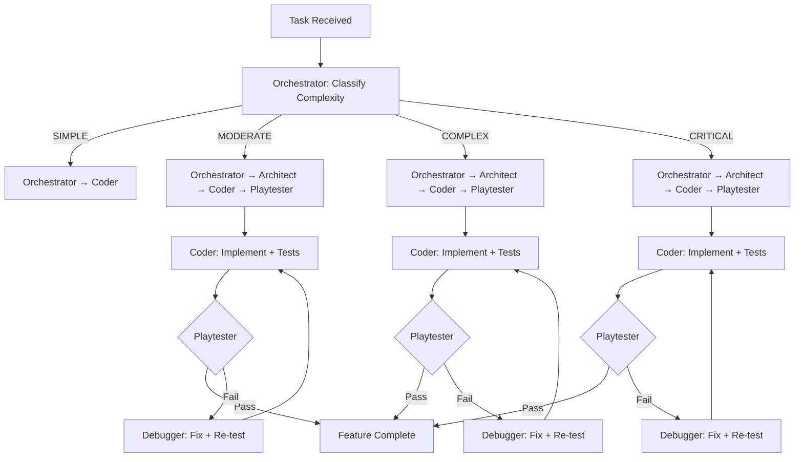
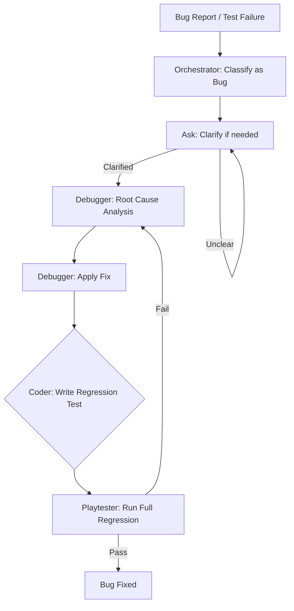

# DarkDelve Orchestration System Design

## 1. Overview

The DarkDelve orchestration system coordinates two primary development flows:

1. **Feature Creation Flow** — designing, implementing, and validating new game features
2. **Bug Fixing Flow** — diagnosing, fixing, and regression-testing defects

Both flows leverage a multi-mode architecture where each stage is handled by a specialized mode with defined responsibilities, model assignments, and handoff mechanisms.

The orchestration layer sits atop the existing SOLID architecture (Presentation → Application → Domain → Infrastructure → Shared) and uses the workflow controller, agent system, MCP toolkit, and playtest subsystem as execution backends.

---

## 2. Architecture Diagram

```
┌─────────────────────────────────────────────────────────────────────┐
│                     ORCHESTRATION LAYER                             │
│                                                                     │
│  ┌─────────────────────┐       ┌─────────────────────┐             │
│  │  Feature Creation   │       │   Bug Fixing Flow   │             │
│  │       Flow          │       │                     │             │
│  └─────────┬───────────┘       └─────────┬───────────┘             │
│            │                             │                         │
│            ▼                             ▼                         │
│  ┌─────────────────────────────────────────────────────────────┐   │
│  │              WorkflowController (Orchestrator)               │   │
│  │              - classify complexity                           │   │
│  │              - determine stage pipeline                       │   │
│  │              - route to mode handlers                        │   │
│  └────────────┬──────────┬──────────┬──────────┬────────────────┘   │
│               │          │          │          │                    │
│               ▼          ▼          ▼          ▼                    │
│  ┌──────────┐ ┌────────┐ ┌────────┐ ┌──────────┐ ┌──────────────┐  │
│  │Architect │ │ Code   │ │Debug   │ │Playtest  │ │Ask (Clarify) │  │
│  │  Mode    │ │ Mode   │ │ Mode   │ │  Mode    │ │    Mode      │  │
│  └────┬─────┘ └───┬────┘ └───┬────┘ └────┬─────┘ └──────┬───────┘  │
│       │           │          │           │              │           │
│       ▼           ▼          ▼           ▼              ▼           │
│  ┌─────────────────────────────────────────────────────────────┐   │
│  │                    Domain Services Layer                     │   │
│  │  Perception │ Behavior │ Combat │ Movement │ Social │ Loot   │   │
│  └─────────────────────────┬───────────────────────────────────┘   │
│                             │                                       │
│  ┌──────────────────────────▼──────────────────────────────────┐   │
│  │                    Agent System Layer                        │   │
│  │  LLMAgent │ RandomAgent │ CommanderAgent │ DungeonMaster     │   │
│  └──────────────────────────┬──────────────────────────────────┘   │
│                             │                                       │
│  ┌──────────────────────────▼──────────────────────────────────┐   │
│  │              MCP Toolkit & Infrastructure                    │   │
│  │  mcp_toolkit │ mcp_integration │ instruction_bus │ ollama    │   │
│  └─────────────────────────────────────────────────────────────┘   │
└─────────────────────────────────────────────────────────────────────┘
```

---

## 3. Mode Responsibilities

### 3.1 Orchestrator Mode (🪃)

**File**: `src/application/workflow/workflow_controller.py`

| Aspect | Detail |
|--------|--------|
| **Role** | Top-level coordinator; receives tasks and dispatches them through the pipeline |
| **Model** | `openrouter/owl-alpha` (default orchestrator model) |
| **Input** | Task ID, task description, optional complexity override |
| **Output** | `WorkflowResult` with stage results, success/failure status, duration metrics |
| **Key Methods** | `classify_complexity()`, `should_run_playtester()`, `should_run_debugger()`, `run_workflow()` |

**Responsibilities**:
- Classify task complexity: `SIMPLE`, `MODERATE`, `COMPLEX`, `CRITICAL`
- Determine which stages to run based on complexity and prior stage results
- Route execution to appropriate mode handlers
- Collect results from each stage and determine final success/failure
- Maintain execution log for audit trail

**Complexity Classification Rules**:

| Complexity | Keywords | Stages Executed |
|------------|----------|-----------------|
| `CRITICAL` | core, engine, save system, rendering pipeline, game loop, event bus, entity system, combat system | Orchestrator → Architect → Coder → Playtester → Debugger (on failure) |
| `COMPLEX` | system, feature, architecture, pipeline, framework, module, service, component, agent, multi-level (≥2 matches) | Orchestrator → Architect → Coder → Playtester → Debugger (on failure) |
| `MODERATE` | add, update, modify, extend, improve, enhance | Orchestrator → Architect → Coder → Playtester (on success) |
| `SIMPLE` | (default) | Orchestrator → Coder |

### 3.2 Architect Mode (🏗️)

**File**: Architecture design documents in `architecture/`

| Aspect | Detail |
|--------|--------|
| **Role** | Design solutions, identify integration points, plan file changes |
| **Model** | `openrouter/owl-alpha` (architect model) |
| **Input** | Task description, existing architecture context, relevant source files |
| **Output** | Design document with module specifications, integration points, file change list |

**Responsibilities**:
- Analyze task requirements against existing architecture
- Identify affected modules across all layers (Domain, Application, Infrastructure, Presentation, Shared)
- Design new components/entities/services following SOLID principles
- Specify interfaces and dependency injection wiring
- Identify integration points with existing systems
- Produce file change plan: files to create, files to modify

**Design Constraints**:
- All new components must follow existing component composition pattern (`src/domain/components/`)
- New services must implement corresponding interfaces from `src/shared/interfaces/`
- Domain layer must not depend on infrastructure layer
- New commands/queries must extend `BaseCommand`/`BaseQuery`
- Agent behaviors must validate against `MOB_BEHAVIOR_CATALOG`

### 3.3 Code Mode (💻)

**Files**: Implementation across `src/` modules

| Aspect | Detail |
|--------|--------|
| **Role** | Implement approved designs, write tests, update TODO lists |
| **Model** | `openrouter/owl-alpha` (code model) |
| **Input** | Design document from Architect, existing source files |
| **Output** | Implemented code, passing tests, updated TODO list |

**Responsibilities**:
- Implement designs specified by Architect mode
- Follow existing code patterns and conventions
- Write unit tests for all new modules (in `tests/`)
- Update `update_todo_list` for progress tracking
- Ensure all imports use `src.` prefix (per project convention)
- Maintain type hints and docstrings throughout

**Implementation Rules**:
- New entities → `src/domain/entities/`
- New components → `src/domain/components/`
- New value objects → `src/domain/value_objects/` (must be `@dataclass(frozen=True)`)
- New domain services → `src/domain/services/`
- New commands → `src/application/game_commands/`
- New queries → `src/application/game_queries/`
- New event handlers → `src/application/event_system/handlers/`
- New repository → `src/infrastructure/repositories/`
- New external service → `src/infrastructure/external/`
- Tests → `tests/test_<module_name>.py`

### 3.4 Debug Mode (🪲)

**Files**: Debug scripts in `playtest/`, `debug_*.py`

| Aspect | Detail |
|--------|--------|
| **Role** | Root cause discovery, targeted fixes, regression verification |
| **Model** | `openrouter/owl-alpha` (debug model) |
| **Input** | Error reports, test failures, telemetry data, stack traces |
| **Output** | Root cause analysis, fixed code, passing regression tests |

**Responsibilities**:
- Analyze errors from test failures, crashes, or telemetry
- Identify root cause using systematic debugging approach
- Apply minimal, targeted fixes
- Verify fix does not introduce regressions
- Add tests for discovered bugs (per project rules)

**Debugging Constraints**:
- Before declaring a problem fixed, must run all tests
- If a problem is found that a test did not catch, must add a test for it
- Debug telemetry is limited to 800-line reads (per global instructions)
- Coordinate with Playtester mode for regression verification

### 3.5 Playtest Mode (🎮)

**Files**: `playtest/run_playtest.py`, `src/infrastructure/services/mcp_integration.py`

| Aspect | Detail |
|--------|--------|
| **Role** | Automated gameplay testing, telemetry collection, regression coverage |
| **Model** | `qwen2.5-coder:7b-instruct` (via Ollama, configured in `playtest/playtest_config.yaml`) |
| **Input** | Game build, test scenarios, instruction bus payloads |
| **Output** | `MCPPlaytestResult` with status, turns, telemetry entries, final frame |

**Responsibilities**:
- Drive game through stdin/stdout using `MCPPlaytester`
- Collect telemetry per turn (action, reasoning, stats, frame)
- Detect crashes, non-zero exits, and hangs
- Run regression test suites
- Validate game balance and behavior against scenarios

**Playtest Configuration** (`playtest/playtest_config.yaml`):

```yaml
endpoint: http://localhost:11434
model: qwen2.5-coder:7b-instruct
persona: Default
temperature: 0.7
max_turns: 100
game_command:
  - python
  - darkdelve.py
telemetry_path: playtest/playtest_telemetry.json
instruction_path: playtest/instructions.json
```

**Playtest Loop**:
```
render_frame_text → extract_stats → agent.decide() → game.main_loop(action) → telemetry.append()
```

### 3.6 Ask Mode (❓)

**Files**: Documentation in `architecture/`, `docs/`

| Aspect | Detail |
|--------|--------|
| **Role** | Clarification, documentation, code explanation |
| **Model** | `openrouter/owl-alpha` |
| **Input** | Questions about code, architecture, or design intent |
| **Output** | Explanations, diagrams, code walkthroughs |

**Responsibilities**:
- Answer questions about existing code and architecture
- Explain design decisions and trade-offs
- Provide code walkthroughs for complex flows
- Generate documentation and diagrams
- Clarify ambiguous requirements before implementation

---

## 4. Flow Definitions

### 4.1 Feature Creation Flow



**Stage Details**:

| Stage | Mode | Handoff Trigger | Output Artifact |
|-------|------|-----------------|-----------------|
| 1. Classify | Orchestrator | Task received | `TaskComplexity` enum |
| 2. Design | Architect (moderate+) | Classification complete | Design document in `plans/` |
| 3. Implement | Coder | Design approved (or SIMPLE skip) | Code + tests in `src/` and `tests/` |
| 4. Validate | Playtester (moderate+) | Coder success | `MCPPlaytestResult` |
| 5. Debug | Debugger (on failure) | Playtest failure | Fixed code + passing tests |

**Handoff Mechanisms**:

- **Orchestrator → Architect**: `WorkflowController._run_architect()` produces `TaskResult` with `files_to_create` and `files_to_modify` metrics
- **Architect → Coder**: Design document written to `plans/` directory, consumed by Coder mode
- **Coder → Playtester**: Code committed; `WorkflowController.should_run_playtester()` returns True
- **Playtester → Debugger**: `TaskResult.success` is False; `WorkflowController.should_run_debugger()` returns True
- **Debugger → Coder**: Fixes applied; cycle repeats

### 4.2 Bug Fixing Flow



**Stage Details**:

| Stage | Mode | Handoff Trigger | Output Artifact |
|-------|------|-----------------|-----------------|
| 1. Receive | Orchestrator | Bug report or test failure | Task classification |
| 2. Clarify | Ask (if needed) | Ambiguity detected | Clarified requirements |
| 3. Diagnose | Debugger | Clear problem statement | Root cause analysis |
| 4. Fix | Debugger | Root cause identified | Fixed code |
| 5. Regression Test | Coder | Fix applied | New test in `tests/` |
| 6. Verify | Playtester | Regression test written | Full regression pass |

**Handoff Mechanisms**:

- **Orchestrator → Ask**: Ambiguity in bug report triggers clarification
- **Ask → Debugger**: Clarified problem statement handed off
- **Debugger → Coder**: Fix applied; regression test needed
- **Coder → Playtester**: Regression test written; full verification needed
- **Playtester → Debugger**: New failures detected; re-enter diagnosis

---

## 5. Model Assignments

| Mode | Model | Rationale |
|------|-------|-----------|
| Orchestrator | `openrouter/owl-alpha` | High-level reasoning, complexity classification |
| Architect | `openrouter/owl-alpha` | Design reasoning, system-level thinking |
| Code | `openrouter/owl-alpha` | Code generation, pattern following |
| Debug | `openrouter/owl-alpha` | Root cause analysis, systematic debugging |
| Playtester | `qwen2.5-coder:7b-instruct` (via Ollama) | Game action decisions, persona-driven behavior |
| Ask | `openrouter/owl-alpha` | Explanatory reasoning, documentation |

**Model Configuration**:

```yaml
# orchestrator_config.yaml (conceptual)
orchestrator:
  model: openrouter/owl-alpha
  context_budget_tokens: 8192
  
architect:
  model: openrouter/owl-alpha
  context_budget_tokens: 16384  # Larger context for design
  
coder:
  model: openrouter/owl-alpha
  context_budget_tokens: 16384  # Larger context for implementation
  
debugger:
  model: openrouter/owl-alpha
  context_budget_tokens: 8192

playtester:
  model: qwen2.5-coder:7b-instruct
  endpoint: http://localhost:11434
  temperature: 0.7
  max_turns: 100
```

---

## 6. Handoff Mechanisms

### 6.1 TaskResult Protocol

All stages communicate results through the `TaskResult` dataclass:

```python
@dataclass
class TaskResult:
    stage: str           # "orchestrator", "architect", "coder", "playtester", "debugger"
    success: bool        # Stage passed/failed
    output: str          # Summary output
    errors: List[str]    # Error messages if failed
    warnings: List[str]  # Non-fatal warnings
    duration_seconds: float
    metrics: Dict[str, Any]  # Stage-specific metrics
```

### 6.2 WorkflowResult Aggregation

```python
@dataclass
class WorkflowResult:
    task_id: str
    task_description: str
    complexity: str
    stages_completed: List[str]
    stage_results: List[TaskResult]
    final_success: bool
    total_duration_seconds: float
    playtest_triggered: bool
    debugger_triggered: bool
```

### 6.3 File-Based Handoffs

| Handoff | File Location | Format |
|---------|--------------|--------|
| Architect → Coder | `plans/<task_name>_design.md` | Markdown with code blocks |
| Coder → Test | `tests/test_<module>.py` | pytest test file |
| Playtester → Telemetry | `playtest/playtest_telemetry.json` | JSON array |
| Debugger → Report | `playtest/debug_output.json` | JSON with stack traces |

### 6.4 Instruction Bus (Playtest Communication)

The `InstructionBus` (`playtest/instruction_bus.py`) enables external operators to inject instructions into playtest prompts:

```json
{
  "enabled": true,
  "target": "all",
  "setup": "Persistent guidance for the LLM",
  "push": "Live instruction for the current playtest session"
}
```

Target scopes: `all`, `player`, `game`, `dungeon_master`/`dm`, `commander`

---

## 7. Agent System Integration

### 7.1 Agent Pipeline in Game Loop

```
Game.main_loop()
  ├── EnergySystem.next_actor()
  ├── AgentManager.process_turn(actor, game_state, context)
  │     ├── agent.perceive(game_state) → PerceptionResult
  │     ├── agent.decide(perception) → AgentAction
  │     └── agent.execute(action, context) → ActionResult
  └── AgentTurnProcessor._execute_agent_action(actor, action)
        ├── _execute_movement() → actor.move_to()
        └── _execute_combat() → game.attack()
```

### 7.2 Entity AI Orchestrator

`EntityAIOrchestrator` (`src/domain/services/entity_ai_orchestrator.py`) coordinates the full AI pipeline per tick:

1. **Perception Phase**: Update perception for all entities with perception components
2. **Behavior Phase**: Evaluate behavior scripts against perception status
3. **Social Phase**: Check for desertion/betrayal events

### 7.3 Dungeon Master Agent

`DungeonMasterAgent` (`src/domain/agents/dungeon_master_agent.py`) provides LLM-powered:
- Behavior script generation for entities
- Level design based on player profile
- Social structure management

### 7.4 MCP Toolkit

`MCPToolkit` (`src/infrastructure/services/mcp_toolkit.py`) provides tools for LLM-driven game manipulation:

| Tool | Purpose |
|------|---------|
| `create_mob(mob_type, position, name)` | Spawn new monsters |
| `add_item(entity_id, item_id)` | Add items to inventories |
| `modify_stat(entity_id, stat, delta)` | Modify entity stats |
| `request_map_section(x, y, w, h)` | Request map data slices |
| `write_live_config(key, value)` | Update persistent config |
| `read_live_config(key)` | Read from live config |
| `list_entities()` | List all entities |
| `send_message(message, recipient)` | Send messages to player |

---

## 8. Playtest Subsystem

### 8.1 Architecture

```
ollama_playtester.py
├── Popen launches darkdelve.py with piped stdin/stdout/stderr
├── ConsoleFrameParser splits \033[H\033[2J ASCII frames
├── PlayerAgent builds Survive & Explore prompt + persona + 5-turn history
├── Ollama /api/generate with "format": "json"
├── JSON response validated against macro_goal/reasoning/action/telemetry_notes
├── action injected as one line into game stdin
└── TelemetryStore.append() writes to playtest/playtest_telemetry.json
```

### 8.2 In-Process Playtest (MCPPlaytester)

`MCPPlaytester` (`src/infrastructure/services/mcp_integration.py`) drives the game in-process:

```python
class MCPPlaytester:
    def run(self) -> MCPPlaytestResult:
        # Loop: render → decide → main_loop(action) → telemetry
        # Until: max_turns, crash, or player death
```

### 8.3 Player Agent

`PlayerAgent` (`player_agent.py`) builds prompts and validates responses:

- System prompt: Survive & Explore baseline + persona + JSON schema
- User prompt: frame, stats, recent 5-turn history
- Validation: schema check, action sanitization, fallback to safe wait action `e`
- History: rolling 5-turn buffer

### 8.4 Built-in Personas

| Persona | Behavior |
|---------|----------|
| Default | Balanced survival and exploration |
| Aggressive Stress-Tester | Pushes combat boundaries, seeks fights |
| Boundary Pushing Explorer | Explores map edges, tests movement limits |

---

## 9. Domain Services Integration

### 9.1 Service Inventory

| Service | File | Interface | Purpose |
|---------|------|-----------|---------|
| PerceptionService | `src/domain/services/perception_service.py` | — | Compute entity perception status |
| BehaviorScriptService | `src/domain/services/behavior_script_service.py` | — | Evaluate behavior trees |
| ActionDispatcher | `src/domain/services/action_dispatcher.py` | — | Route behavior actions to handlers |
| CombatService | `src/domain/services/combat_service.py` | `ICombatService` | Combat resolution |
| MovementService | `src/domain/services/movement_service.py` | `IMovementService` | Entity movement |
| SocialService | `src/domain/services/social_service.py` | `ISocialService` | Social structures, loyalty |
| FleeStrategy | `src/domain/services/flee_strategy.py` | — | Flee behavior logic |
| InventoryService | `src/domain/services/inventory_service.py` | — | Inventory management |
| LootService | `src/domain/services/loot_service.py` | — | Loot plan application |
| SurvivalService | `src/domain/services/survival_service.py` | — | Survival mechanics |
| LevelDesignService | `src/domain/services/level_design_service.py` | — | LLM-driven level design |
| DungeonMasterService | `src/domain/services/dungeon_master_service.py` | — | Dungeon generation orchestration |
| EntityAIOrchestrator | `src/domain/services/entity_ai_orchestrator.py` | — | Per-tick AI pipeline |
| PlanGenerator | `src/domain/services/plan_generator.py` | — | Multi-step behavior plans |
| PlayerProfileService | `src/domain/services/player_profile_service.py` | — | Player profile building |
| NarrativeService | `src/domain/services/narrative_service.py` | — | Story progression |
| PuzzleService | `src/domain/services/puzzle_service.py` | — | Puzzle mechanics |
| ItemFactoryService | `src/domain/services/item_factory_service.py` | — | Dynamic item creation |
| AgentCommunication | `src/domain/services/agent_communication.py` | — | Agent-to-agent messaging |
| ContextManager | `src/domain/services/context_manager.py` | — | LLM context window management |

### 9.2 Service Dependency Graph

```
EntityAIOrchestrator
├── PerceptionService
│     └── FOVQuery (Application Layer)
├── BehaviorScriptService
│     └── ActionDispatcher
│           ├── CombatService (ICombatService)
│           ├── MovementService (IMovementService)
│           ├── SocialService (ISocialService)
│           └── FleeStrategy
│                 └── MovementService
└── SocialService

DungeonMasterAgent
├── LevelDesignService
│     └── OllamaService (Infrastructure)
├── PlayerProfileService
└── LLMLogger

ActionDispatcher
├── ICombatService → CombatService
├── IMovementService → MovementService
├── ISocialService → SocialService
└── FleeStrategy
```

---

## 10. Pipeline Execution Engine

### 10.1 Pipeline Configuration

```python
@dataclass
class PipelineConfig:
    auto_playtest: bool = False
    auto_debug: bool = True
    max_retries: int = 3
    test_command: str = "python -m pytest tests/ --tb=short -q"
    context_budget_tokens: int = 8192
```

### 10.2 Default Pipeline Stages

| Stage | Mode | Enabled By Default | Condition |
|-------|------|-------------------|-----------|
| orchestrator | orchestrator | Always | — |
| architect | architect | False | Enabled for moderate+ tasks |
| coder | code | Always | — |
| playtester | play-testor | False | Enabled by controller logic |
| debugger | debug | False | Enabled on failure |

### 10.3 Execution Report Format

```
=== PIPELINE EXECUTION REPORT ===
  [✓] orchestrator: Analyzed task 'feature_combat_overhaul'
  [✓] architect: Architecture design for 'feature_combat_overhaul'
  [✓] coder: Implementation complete for 'feature_combat_overhaul'
  [✗] playtester: Playtest failed for 'feature_combat_overhaul'
  [✓] debugger: Debugged 3 issues for 'feature_combat_overhaul'
```

---

## 11. Key Constraints and Gotchas

### 11.1 Import Convention

All imports must use `src.` prefix:
```python
from src.application.game_commands.base_command import BaseCommand
from src.domain.entities.player import Player
```

### 11.2 Dungeon Map Conventions

```
dungeon_map[x, y]  — indexed as [x, y] (not [row, col])
True  = wall (blocked)
False = floor (walkable)
```

### 11.3 FOV Coordinate System

```python
# Correct: pass (x, y) to compute_fov
fov = tcod.map.compute_fov(
    transparency=~dungeon_map,
    pov=(safe_x, safe_y),  # (x, y) NOT (y, x)
    radius=self.radius,
)
```

### 11.4 Console Rendering

```python
# Correct: use terminal cursor positioning
def present(self) -> None:
    sys.stdout.write("\033[H\033[2J" + frame + "\033[0m\n")
```

### 11.5 Playtest Loop Order

```
render → decide → main_loop(action) → telemetry
```
Never skip steps or reorder.

### 11.6 Energy System Integration

```python
# Player gets startup priority on new levels
initial_energy = 100 if entity is self.player else 0
self.energy_system.add_entity(entity, initial_energy=initial_energy)
```

### 11.7 LLM Response Validation

```python
# Always validate JSON responses from LLMs
# Always include "format": "json" in Ollama payloads
# Fall back to safe wait action on invalid responses
# Log all validation failures in telemetry
```

---

## 12. File Reference

### 12.1 Core Orchestration Files

| File | Purpose |
|------|---------|
| `src/application/workflow/workflow_controller.py` | Workflow orchestration and complexity classification |
| `src/application/workflow/pipeline.py` | Pipeline execution engine and stage configuration |

### 12.2 Agent System Files

| File | Purpose |
|------|---------|
| `src/domain/agents/base.py` | Abstract Agent base class, PerceptionResult |
| `src/domain/agents/actions.py` | AgentAction, ActionType enum |
| `src/domain/agents/state.py` | AgentGameState, EntityState, ItemState |
| `src/domain/agents/llm_agent.py` | LLMAgent, RandomAgent, LLMAgentConfig |
| `src/domain/agents/commander_agent.py` | CommanderAgent, AgentManager |
| `src/domain/agents/dungeon_master_agent.py` | DungeonMasterAgent |
| `src/domain/agents/integration.py` | AgentTurnProcessor, create_agent_game_state_snapshot |

### 12.3 Domain Service Files

| File | Purpose |
|------|---------|
| `src/domain/services/entity_ai_orchestrator.py` | Per-tick AI pipeline coordination |
| `src/domain/services/action_dispatcher.py` | Behavior action routing and execution |
| `src/domain/services/behavior_script_service.py` | Behavior tree evaluation |
| `src/domain/services/perception_service.py` | Entity perception computation |
| `src/domain/services/combat_service.py` | Combat resolution (ICombatService) |
| `src/domain/services/movement_service.py` | Movement handling (IMovementService) |
| `src/domain/services/social_service.py` | Social structures (ISocialService) |
| `src/domain/services/flee_strategy.py` | Flee behavior logic |
| `src/domain/services/level_design_service.py` | LLM-driven level generation |
| `src/domain/services/dungeon_master_service.py` | Dungeon generation orchestration |
| `src/domain/services/plan_generator.py` | Multi-step behavior plan generation |
| `src/domain/services/agent_communication.py` | Agent-to-agent messaging |
| `src/domain/services/context_manager.py` | LLM context window management |

### 12.4 Infrastructure Files

| File | Purpose |
|------|---------|
| `src/infrastructure/services/mcp_integration.py` | MCPPlaytester, in-process playtesting |
| `src/infrastructure/services/mcp_toolkit.py` | MCPToolkit, TOOL_REGISTRY |
| `src/infrastructure/external/ollama_service.py` | Ollama LLM integration |

### 12.5 Playtest Files

| File | Purpose |
|------|---------|
| `playtest/playtest_config.yaml` | Playtest configuration |
| `playtest/instruction_bus.py` | File-based instruction injection |
| `playtest/run_playtest.py` | Playtest runner |
| `ollama_playtester.py` | Subprocess-based Ollama playtester |
| `player_agent.py` | Player AI agent for playtesting |

### 12.6 Architecture Documentation

| File | Purpose |
|------|---------|
| `architecture/agent_system.md` | Agent system design |
| `architecture/system_overview.md` | High-level SOLID architecture |
| `architecture/module_design.md` | Module structure and dependencies |
| `architecture/implementation_plan.md` | Step-by-step implementation guide |
| `architecture/gotchas.md` | Common pitfalls and solutions |
| `architecture/ATTENTION.md` | Code location cheat sheet |
| `architecture/solid_design.md` | SOLID principles application |

---

## 13. Execution Example

### 13.1 Feature Creation Example

```
Input: "Add a new combat mechanic: shield bash"

1. Orchestrator:
   - classify_complexity("Add a new combat mechanic: shield bash")
   - Result: MODERATE (matches: "add", "combat")
   - Pipeline: Orchestrator → Architect → Coder → Playtester

2. Architect:
   - Reads: architecture/combat_system.md, src/domain/services/combat_service.py
   - Designs: New ShieldBashCommand, ShieldBashComponent, updated CombatService
   - Output: plans/shield_bash_design.md
   - Files: 3 new, 2 modified

3. Coder:
   - Reads: plans/shield_bash_design.md
   - Implements: src/application/game_commands/shield_bash_command.py
   - Implements: src/domain/components/shield_bash_component.py
   - Updates: src/domain/services/combat_service.py
   - Tests: tests/test_shield_bash.py (all pass)

4. Playtester:
   - Runs: python -m pytest tests/ --tb=short -q
   - Result: 47 passed, 0 failed
   - Final: SUCCESS
```

### 13.2 Bug Fixing Example

```
Input: "Monster spawns in wall, becomes invisible"

1. Orchestrator:
   - classify_complexity("Monster spawns in wall")
   - Result: SIMPLE
   - Pipeline: Orchestrator → Coder → Debugger

2. Debugger:
   - Reads: architecture/gotchas.md ("Monster and Item Spawning in Walls")
   - Diagnoses: Spawn condition checks dungeon_map[x, y] == True (wall)
   - Fix: Change to `not dungeon_map[x, y]` (floor check)
   - Tests: tests/test_entity_spawning.py (new regression test)

3. Playtester:
   - Runs full regression suite
   - Result: All tests pass
   - Final: BUG FIXED
```

---

## 14. Summary

The DarkDelve orchestration system provides a structured, multi-mode approach to game development:

- **Orchestrator** classifies and routes tasks
- **Architect** designs solutions following SOLID principles
- **Coder** implements with tests following project conventions
- **Debugger** diagnoses root causes and applies targeted fixes
- **Playtester** validates through automated gameplay and telemetry
- **Ask** clarifies ambiguities and documents decisions

All modes communicate through well-defined `TaskResult` and `WorkflowResult` protocols, with file-based handoffs for designs and telemetry. The agent system, domain services, and MCP toolkit provide the execution backbone, while the playtest subsystem ensures quality through automated validation.
