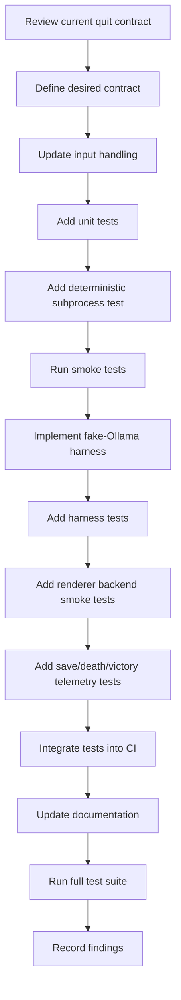

# Playtest Console Quit Contract Improvement Plan
## Overview
This plan focuses on **Priority P1** from the playtest problem exploration plan: fixing the console quit contract so that automated playtests can cleanly exit the game. After addressing P1, the plan follows the recommended sequence for further improvements.
## Tasks
- [ ] Review current console quit contract in [`darkdelve.py`](darkdelve.py:2390) to understand existing behavior (e.g., handling of ESC, Return, and menu options)
- [ ] Define desired console quit contract (e.g., `q` as direct quit, ESC exits menu, Return selects menu items, consistent behavior across console and graphical renderers)
- [ ] Update console input handling in [`darkdelve.py`](darkdelve.py:2248) to implement the defined contract, including mapping `q` to a quit event and ensuring menu selections trigger appropriate actions
- [ ] Add unit tests for console quit contract:
  - Test that sending `q` results in a `tcod.event.Quit` event
  - Test that ESC exits the menu without quitting the game
  - Test that Return on "Quit (No Save)" triggers a quit without saving
- [ ] Add deterministic subprocess integration test that starts the game, sends a sequence of actions (including opening inventory/menu), and exits cleanly, asserting proper termination and telemetry capture
- [ ] Run existing smoke tests (`tests/test_ollama_playtester.py`, `tests/test_console_input.py`, etc.) to verify no regressions after contract changes
- [ ] Implement a fake‑Ollama content‑generation harness with isolated cache and instruction‑bus paths for playtesting
- [ ] Add tests for the fake‑Ollama harness:
  - Verify that content generation returns expected JSON actions
  - Ensure telemetry entries are recorded correctly
  - Confirm cache writes are bounded and isolated per test run
- [ ] Add renderer backend smoke tests for both console and graphical modes:
  - Run a headless graphical test with a minimal tileset
  - Verify that UI components (inventory, character, menu) render without crashes in both backends
- [ ] Add save/death/victory telemetry coverage tests:
  - Configure a temporary playtest config with isolated `save` and `highscore` directories
  - Test save‑and‑quit flow and assert telemetry records a `quit` event
  - Force a deterministic death scenario and assert a `death` telemetry event
  - Force a victory scenario and assert a `victory` telemetry event
- [ ] Ensure all new tests are placed in appropriate test suites (`tests/` hierarchy) and that they run as part of the full CI pipeline
- [ ] Update documentation (`architecture/playtest_problem_exploration_plan.md` and related READMEs) to reflect the finalized console quit contract and testing strategy
- [ ] Execute the full test suite (`pytest -q`) and confirm 100% pass rate
- [ ] Record findings and update the playtest problem exploration plan with results and any remaining open questions
## Recommended Sequence (Mermaid Diagram)

## Acceptance Criteria
1. Automated playtests can cleanly quit the game without external termination.
2. All new tests pass and are included in CI.
3. Documentation reflects the new contract and testing approach.
4. No regressions in existing functionality.
## Next Steps
Please review this plan and let me know if any adjustments are needed before proceeding to implementation.
